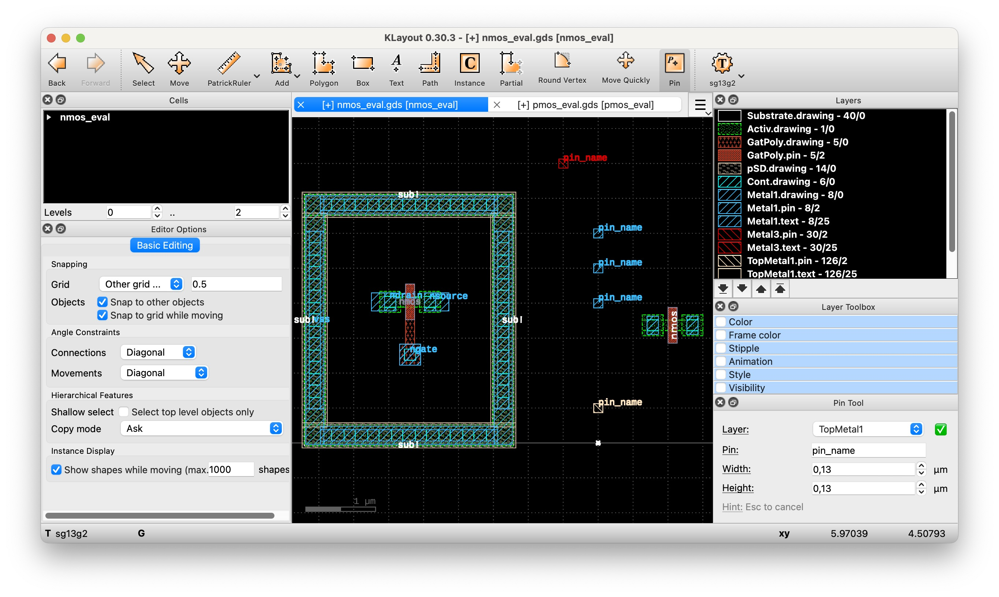

# KLayout Plugin: Pin Tool

<!--

-->

* Boost your layout productivity with quick placement of pins
   * Just select an applicable layer (e.g. `Metal1.drawing`) and enter the pin text
   * Place the pin
   
This add-on can be installed through [KLayout](https://klayout.de) package manager, [see installation instructions here](#installation-instructions)

After installation, this tool can be accessed through *Toolbar*→*Pin*

## Installation using KLayout Package Manager

1. From the main menu, click *Tools*→*Manage Packages* to open the package manager
2. Locate the `PinToolPlugin`, double-click it to select for installation, then click *Apply*
3. Review and close the package installation report
4. Confirm macro execution
